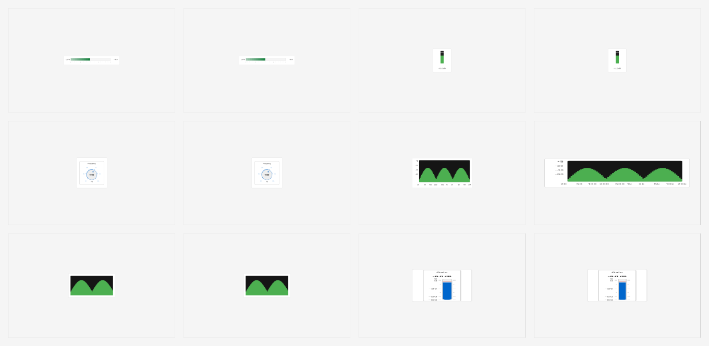

# gpui-toolkit

Libraries, examples, and tooling for building GPUI applications with native
`div()`-based rendering, reusable components, charting primitives, design
tokens, working on all platforms: macOS, Linux, Windows, iOS, tvOS, Android
and WASM.

[](LICENSE)

## Explore the toolkit

The browser gallery is generated from the real WASM showcases. It includes
curated feature snapshots, contact sheets for the complete section matrix, and
links to the live demos.

| UI Kit · buttons | UI Kit · form controls | UI Kit · workflow |
| --- | --- | --- |
| [](https://pierreaubert.github.io/gpui-toolkit/showcase/?section=buttons&theme=dark) | [](https://pierreaubert.github.io/gpui-toolkit/showcase/?section=form-controls&theme=dark) | [](https://pierreaubert.github.io/gpui-toolkit/showcase/?section=workflow&theme=dark) |
| Chart · scatter | Chart · heatmap | Chart · contour |
| [](https://pierreaubert.github.io/gpui-toolkit/px/?section=scatter&theme=dark) | [](https://pierreaubert.github.io/gpui-toolkit/px/?section=heatmap&theme=dark) | [](https://pierreaubert.github.io/gpui-toolkit/px/?section=contour&theme=dark) |

[Browse the generated snapshot gallery and live WASM demos →](https://pierreaubert.github.io/gpui-toolkit/)

The gallery is built with `just demo-site`; `just wasm-gallery` additionally
captures every query-addressable section in the showcase applications.

This is pre-1.0 software with a deliberately narrow crates.io surface. The
first registry wave is `gpui-design`, `gpui-profiler`, and
`gpui-ui-kit-macros`; GPUI-dependent crates are distributed as source beta.
See [RELEASE.md](./RELEASE.md) for exact lanes and guarantees.

## Examples

Two open source examples:

- [SotF](https://github.com/pierreaubert/sotf) available in the [Apple](https://apps.apple.com/ch/app/sound-of-the-future/id6754237332) and [Windows](https://apps.microsoft.com/detail/9NXCMV37NXJ7) app stores, see GH for latest versions and Linux builds, 100% built with this toolkit. It works on ARM and X86 with iOS and macOS ports underway.
- [StkOpt](https://github.com/pierreaubert/stkopt) is a simpler example

## Workspace Crates

| Crate | Purpose |
| --- | --- |
| [gpui-au](./crates/gpui-au/) | macOS Audio Unit platform backend for embedding GPUI rendering inside AUv3 view controllers. |
| [gpui-android](./crates/gpui-android/) | Android platform backend and JNI integration for GPUI applications. |
| [gpui-audio-kit](./crates/gpui-audio-kit/) | Audio-focused UI controls for plugin and playback interfaces, including knobs and vertical sliders. |
| [gpui-builder](./crates/gpui-builder/) | Constraint-based layout solver with responsive display tiers, dividers, auto-axis behavior, and showcase examples. |
| [gpui-component-lab](./crates/gpui-component-lab/) | Prop-driven component lab and responsive preview matrix for design-system conformance work. |
| [gpui-d3rs](./crates/gpui-d3rs/) | D3.js-inspired visualization primitives: scales, shapes, colors, geo projections, force layouts, Delaunay/Voronoi, GPU 2D, and GPU 3D. |
| [gpui-design](./crates/gpui-design/) | Platform-adaptive design system tokens for spacing, corners, typography, animation, and GPUI integration. |
| [gpui-design-tools](./crates/gpui-design-tools/) | CLI tooling for exporting, importing, and validating design tokens and conformance reports. |
| [gpui-hello-web](./crates/gpui-hello-web/) | Minimal wasm/browser spike app running GPUI on the vendored `gpui_web` WebGPU backend via Trunk. |
| [gpui-ios](./crates/gpui-ios/) | iOS/tvOS platform backend for GPUI with Metal rendering, touch input, text input, accessibility, platform views, and hot reload hooks. |
| [gpui-keybinding](./crates/gpui-keybinding/) | Reusable keybinding framework with editor-style preset support for GPUI applications. |
| [gpui-miniapp](./crates/gpui-miniapp/) | Small application shell used by examples and showcases to select the right GPUI platform backend. |
| [gpui-pretext](./crates/gpui-pretext/) | High-performance text measurement and multiline layout utilities. |
| [gpui-profiler](./crates/gpui-profiler/) | Lightweight allocation profiling and hot-path regression utilities. |
| [gpui-px](./crates/gpui-px/) | Plotly Express-style charting API built on `gpui-d3rs` for scatter, line, bar, heatmap, contour, surface, pie, boxplot, and treemap views. |
| [gpui-python-runtime](./crates/gpui-python-runtime/) | Retained scene specification runtime for a GPUI Python wrapper, with an optional showcase. |
| [gpui-scaffolder](./crates/gpui-scaffolder/) | CLI for creating standalone GPUI mini-app projects backed by `gpui-miniapp`. |
| [gpui-themes](./crates/gpui-themes/) | Theme editor and theme showcase infrastructure for GPUI applications. |
| [gpui-ui-kit](./crates/gpui-ui-kit/) | Reusable UI component library: buttons, inputs, dialogs, menus, tabs, tables, QR, command palette, sidebar, wizard, workflow canvas, and more. |
| [gpui-ui-kit-macros](./crates/gpui-ui-kit-macros/) | Procedural macros used by `gpui-ui-kit`, including builder and theme derivation helpers. |
| [gpui-toolkit](./crates/gpui-toolkit/) | Aggregate crate and machine-readable release, stability, and vendored-patch policy manifests. |
| [gpui-showcase](./crates/gpui-showcase/) | Desktop component showcase application. |
| [gpui-showcase-android](./crates/gpui-showcase/android/) | Android native library and Gradle host for the component showcase. |
| [gpui-showcase-ios](./crates/gpui-showcase/ios/) | Static library and Swift host project for showing `gpui-ui-kit` on iOS, with tvOS Rust library build support. |
| [gpui-showcase-tvos](./crates/gpui-showcase/tvos/) | tvOS static library and Swift host for the component showcase. |

## Related Assets

| Path | Purpose |
| --- | --- |
| [figma/](./crates/figma/) | Figma-to-GPUI design-system rules and Code Connect mappings. |
| [MIGRATION.md](./MIGRATION.md) | Migration notes for moving toolkit code out of the larger SOTF workspace. |
| [CONTRIBUTING.md](./CONTRIBUTING.md) | Contribution, testing, public API, and vendored-code workflow. |
| [SECURITY.md](./SECURITY.md) | Supported versions and private vulnerability reporting. |
| [SUPPORT.md](./SUPPORT.md) | Support scope and issue-report requirements. |
| [CODE_OF_CONDUCT.md](./CODE_OF_CONDUCT.md) | Community conduct and enforcement expectations. |
| [AGENTS.md](./AGENTS.md) | Short working guide for agents and contributors. |
| [Renderer gallery](./assets/component-lab-gallery/) | 200 validated Metal-rendered snapshots across the toolkit component stories. |



## GPUI Version

This workspace is currently on the `0.9.x` GPUI toolkit line and vendors GPUI
from Zed `v1.9.0`, as recorded in the GPUI snapshot provenance.

The workspace uses local path dependencies for toolkit crates and history-free
vendored GPUI platform snapshots under `crates/3rdparties/`; the source-origin
gate rejects dependencies that still resolve from `zed-industries/zed.git`.

## Common Commands

```bash
# List tasks
just --list

# Check the workspace
just check

# Build all showcase-style demo targets
just demo

# Build maintained examples by crate family
just examples

# Run focused QA
just qa-gpui-obvious
```

## QA & Non-Regression

The full QA suite is `just qa`. It runs coverage, property tests, visual
non-regression, performance non-regression, and the existing smoke tests:

```bash
just qa           # green canonical gate; coverage floor ratchets upward
just qa-prop      # property-based tests
just qa-visual    # visual/golden/conformance checks
just qa-perf      # benchmark non-regression against qa/perf/baseline.json
just qa-cov       # workspace coverage report (HTML + JSON)
just qa-cov-check # enforced current floor; 90% remains the release target
just qa-release-contract # governance, MSRV metadata, packages, docs, and API policy
```

Update the committed performance baseline after intentional improvements:

```bash
just qa-perf-update
```

See [`qa.md`](./qa.md) for the detailed coverage and non-regression plan, and
[`docs/safety.md`](./docs/safety.md) for the enforced unsafe-Rust boundaries
and review requirements.

If the pinned Rust toolchain is unavailable locally, use an installed toolchain
explicitly:

```bash
cargo +stable check --workspace --all-targets
```

## Scaffolding Mini Apps

Use `gpui-scaffolder` to generate a small standalone GPUI app directory:

```bash
cargo run -p gpui-scaffolder -- my-app
cd my-app
cargo run
```

Generated projects also include a `just run` recipe:

```bash
just run
```

To create the app somewhere else, pass `--output-dir`:

```bash
cargo run -p gpui-scaffolder -- my-app --output-dir /tmp
```

## Demos

The aggregate `just demo` builds:

- `gpui-audio-kit` examples
- `gpui-builder` layout showcase
- `gpui-component-lab`
- `gpui-d3rs` showcase and spinorama demo
- `gpui-px` showcase and spinorama demo
- `gpui-python-runtime` showcase
- `gpui-themes` showcase
- `gpui-ui-kit` showcase

Individual recipes are available as `just demo-ui-kit`, `just demo-d3rs`,
`just demo-px`, `just demo-builder`, `just demo-component-lab`,
`just demo-audio-kit`, `just demo-python`, and `just demo-themes`.

## Examples

The Python declarations can be installed directly from PyPI:

```bash
python -m pip install gpui-toolkit
```

Then import the API as `gpui_toolkit`. Supported-platform wheels include the
matching native rendering host, so no Rust installation is needed. Source
installs and unsupported platforms provide the declarations only and require
`GPUI_TOOLKIT_HOST` when launching a native app.

The aggregate `just examples` builds maintained example families:

```bash
just examples-audio-kit
just examples-builder
just examples-d3rs
just examples-px
just examples-ui-kit
```

For the QR rendering example:

```bash
just run-qr-debug
```

Camera scanning is deliberately left to host applications so the UI kit does
not impose a native capture backend or operating-system permission model.

## iOS

The iOS showcase lives in [crates/gpui-showcase/ios](./crates/gpui-showcase/ios/).
It builds the Rust static library and links it into the bundled Swift
`GPUIShowcase.xcodeproj`.

```bash
# Rust static libraries
just ios-rust-sim
just ios-rust-device

# Copy static libraries into the Xcode project
just ios-build-rust-sim
just ios-build-rust-device

# Generate/update the Xcode project with XcodeGen
just ios-xcodegen

# Build the Swift host app
just ios-sim
just ios-device

# Build simulator hot-reload dylib and manifest
just ios-hot-reload
```

The `showcase-*` recipe names from the old SOTF workspace are also available,
for example `just showcase-build-sim`.

## tvOS

tvOS is a Tier 3 Rust target, so the tvOS recipes use nightly with
`-Zbuild-std`. Install the prerequisites first:

```bash
rustup toolchain install nightly
rustup component add rust-src --toolchain nightly
```

Then build the showcase Rust static library for tvOS:

```bash
just tvos-rust-sim
just tvos-rust-device
just tvos-build-rust-sim
just tvos-build-rust-device
just tvos-sim
just tvos-device
```

This repo currently ships an iOS Swift host project. The tvOS recipes produce
the Rust library artifacts and copy them next to the mobile showcase assets.

## Quick Example

```rust
use gpui::*;
use gpui_ui_kit::{Button, ButtonVariant};
use gpui_px::scatter;

let button = Button::new("submit", "Submit")
    .variant(ButtonVariant::Primary)
    .on_click(|_, _| println!("Clicked"));

let chart = scatter(&x_data, &y_data)
    .title("My Data")
    .build()?;
```

## AI policy

Assisted PRs are welcome and did work very well in the past. In this
repo, models and harnesses are helpful.

## License

[ISC License](LICENSE)
