# GPUI Toolkit renderer gallery

These contact sheets contain 200 real Metal-rendered GPUI snapshots covering
every registered component-lab story. They span UI Kit controls and workflows,
audio components, charts, four viewport families, and Apple HIG, Fluent,
Material 3, Neutral, and reduced-motion presets.

The sheets are generated by the visual QA harness from validated renderer
pixels. Their source captures are also compared against the versioned PR
baseline archive with blank-image, dimension, decode, and pixel-diff gates.

Three additional native simulator/emulator captures demonstrate the same
showcase running through the Android, iOS, and tvOS backends. They are runtime
smoke artifacts rather than replacements for the 200-case renderer regression
set.

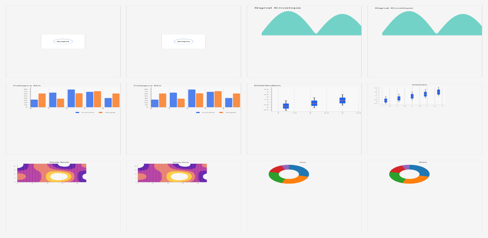
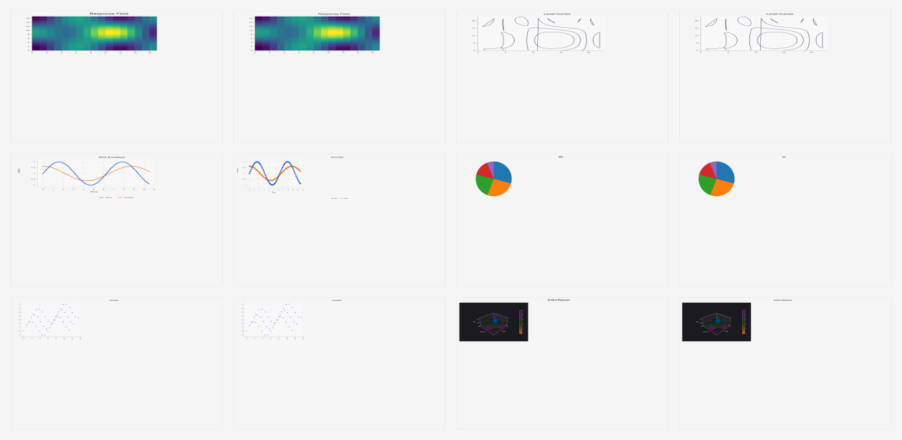
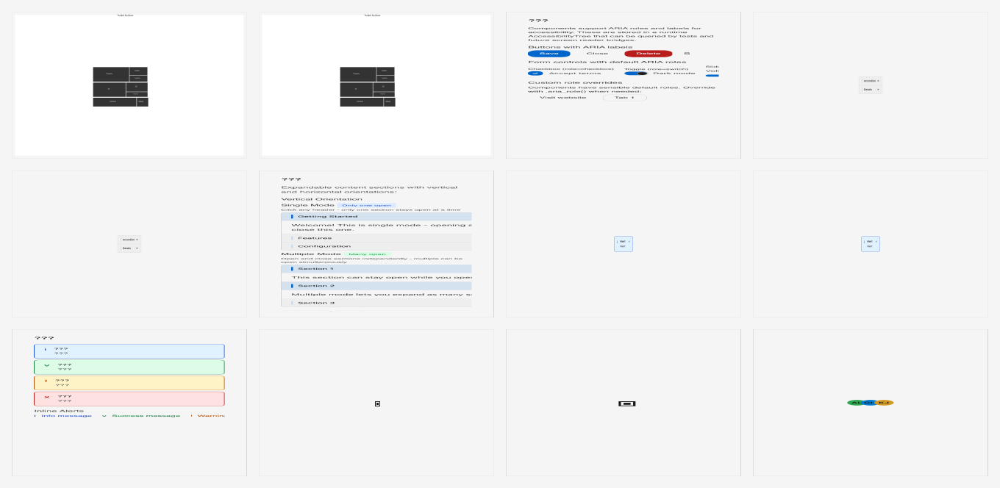
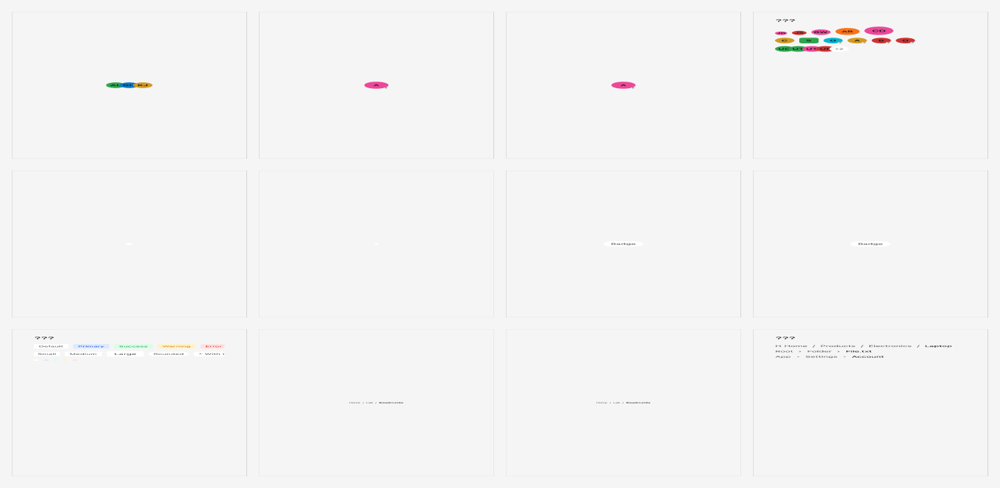
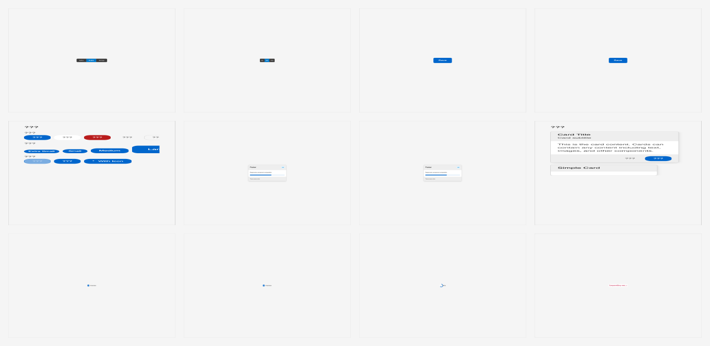
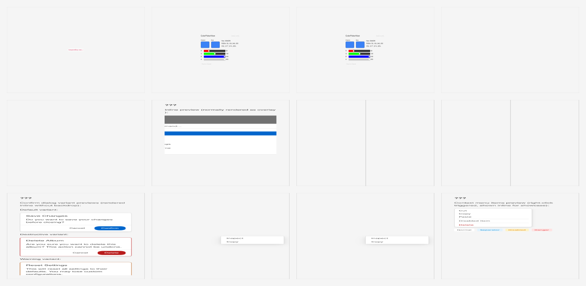
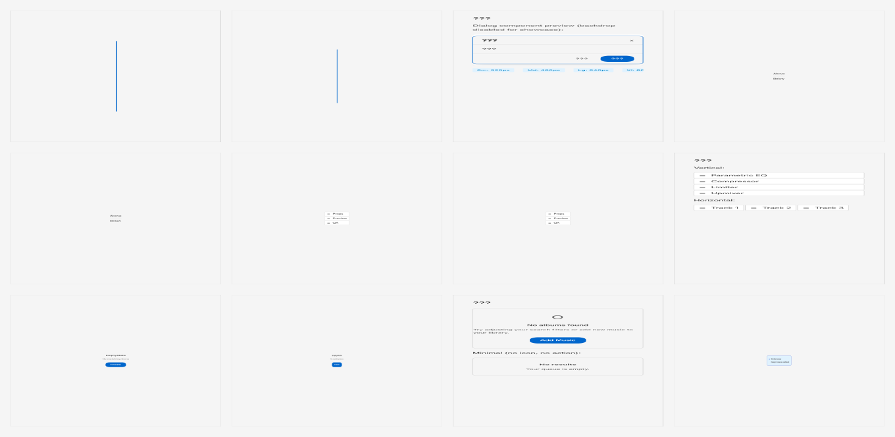
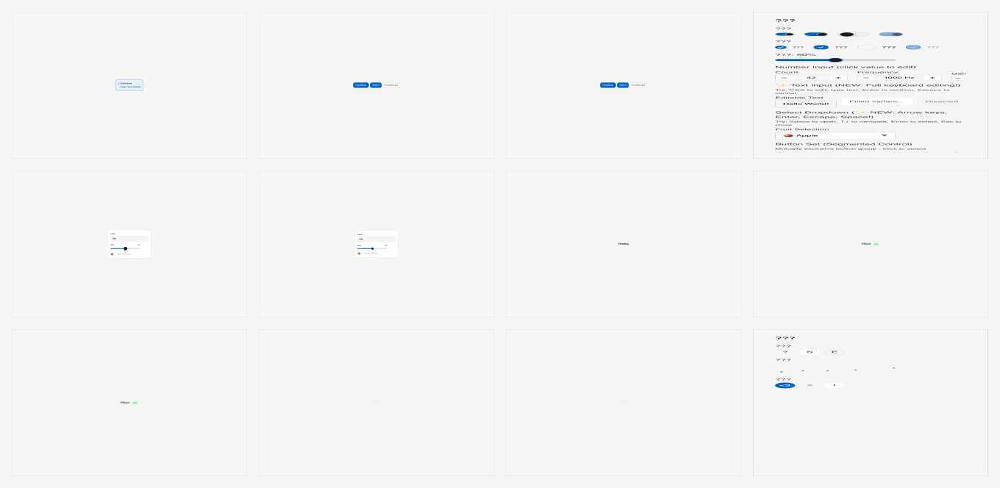
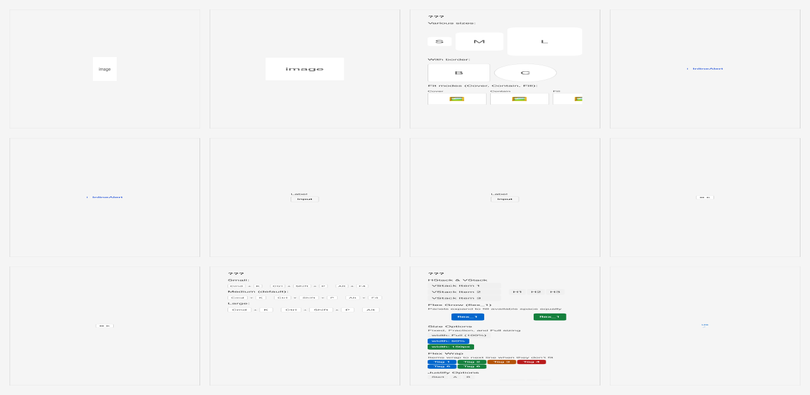
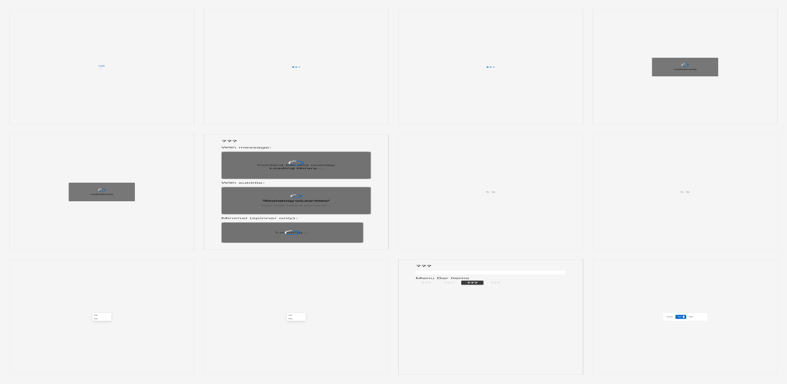
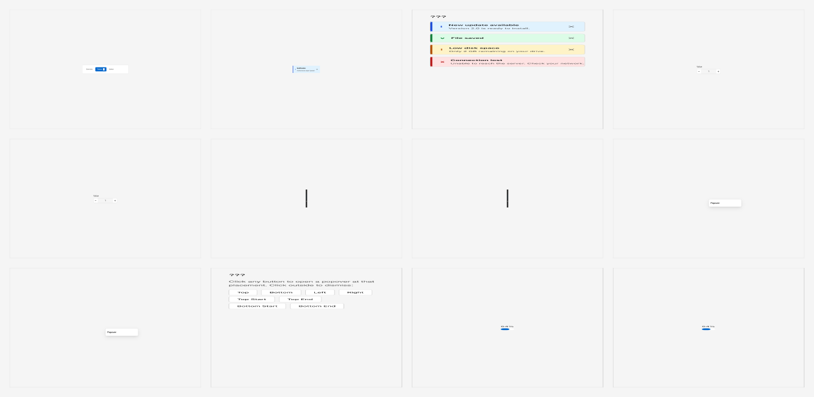
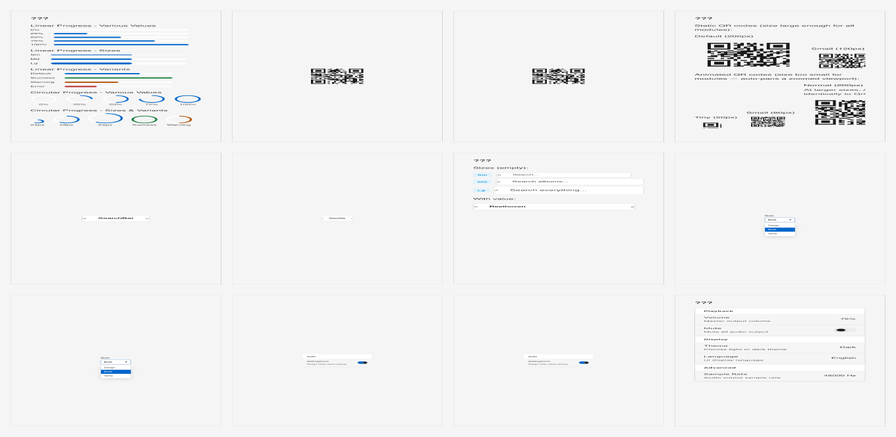
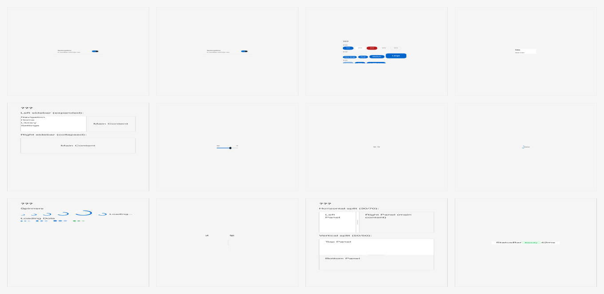
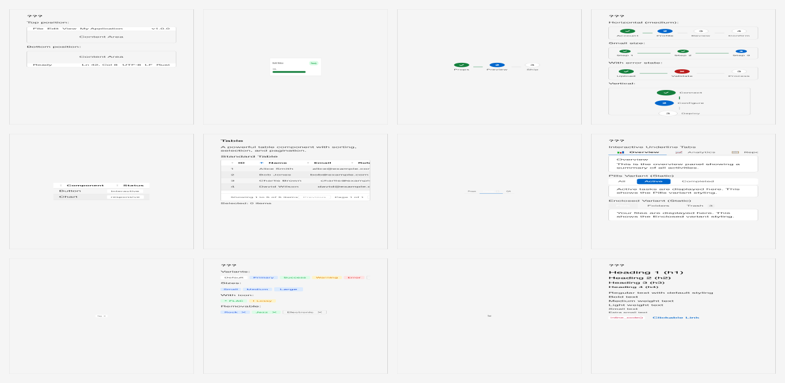
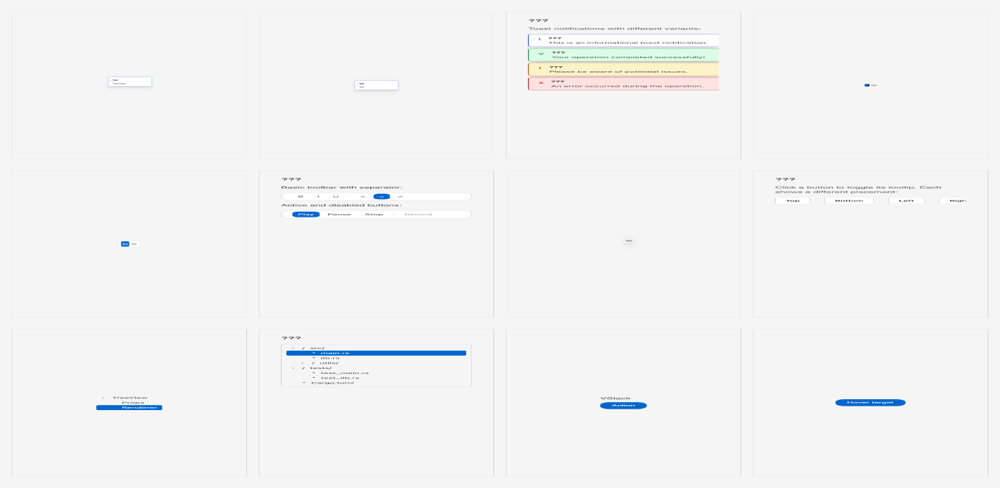
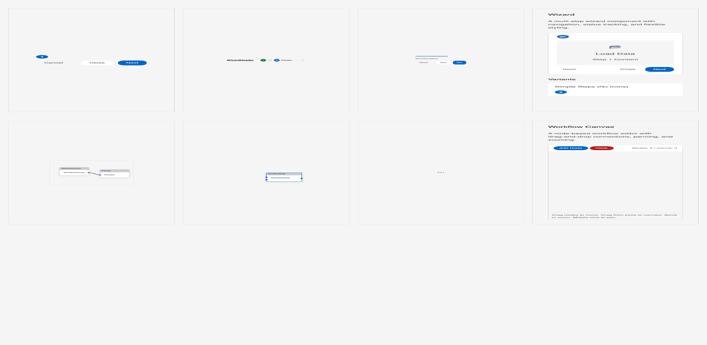

## Native mobile runtime captures

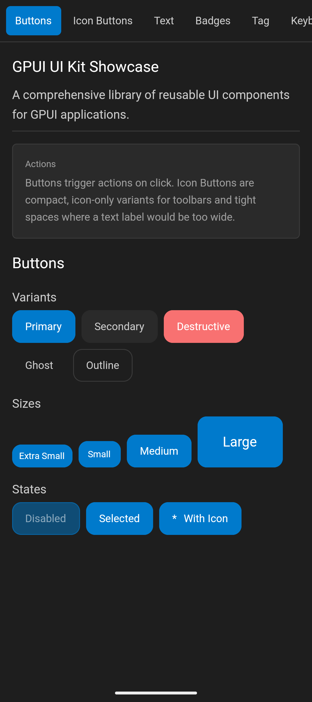
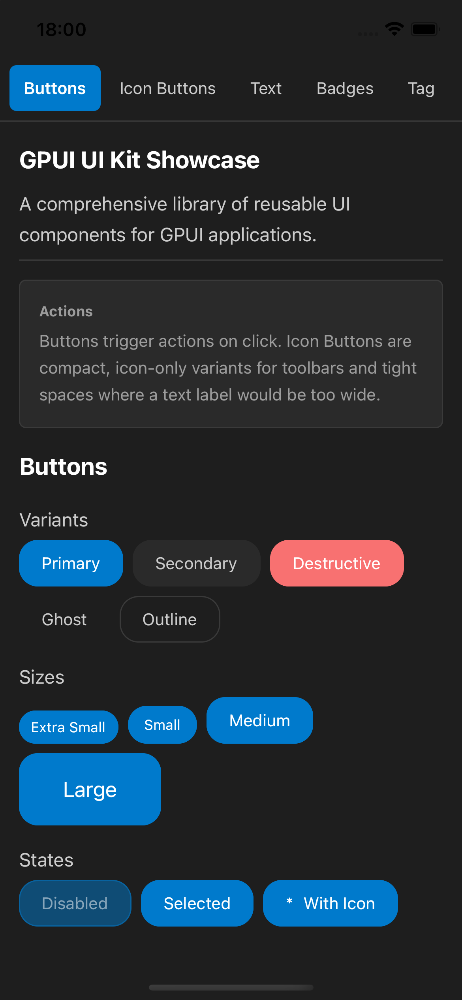
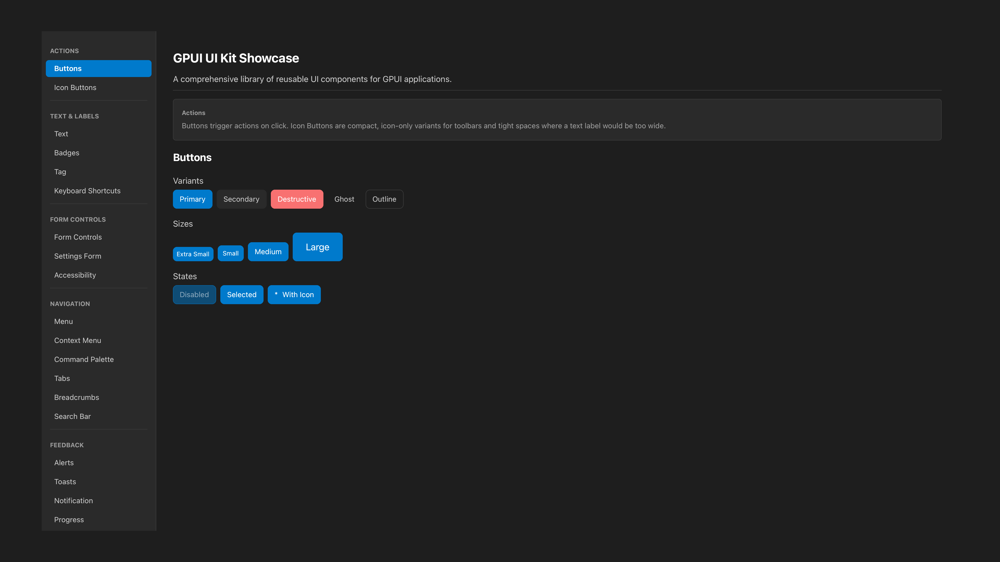
