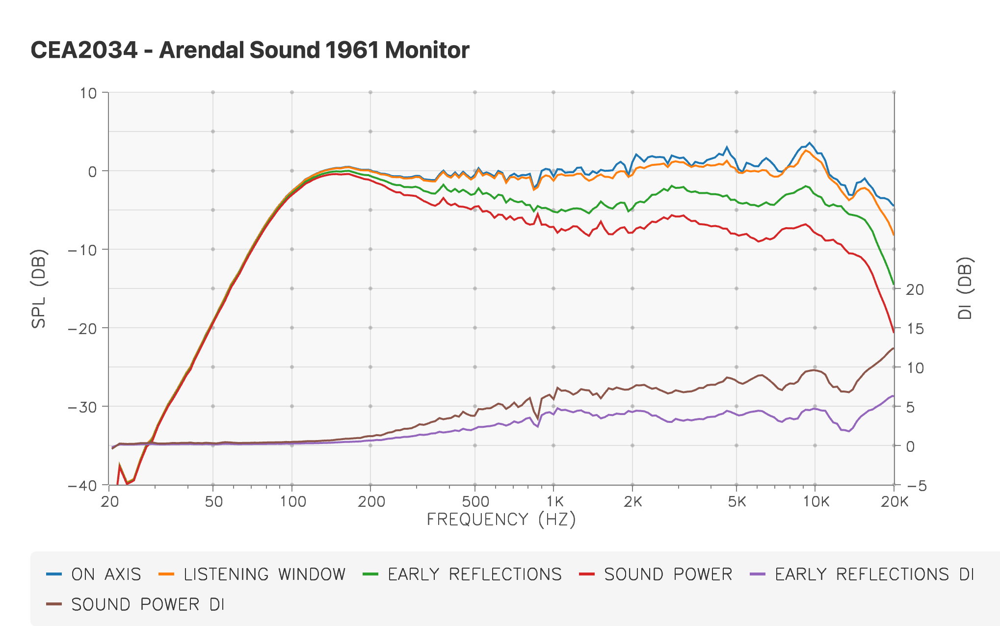
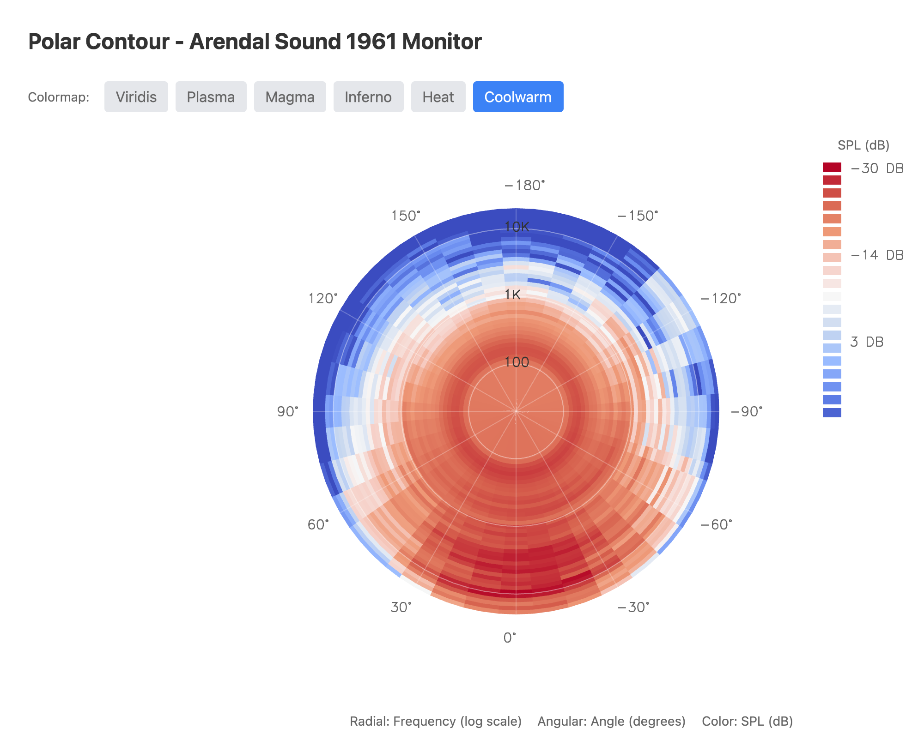

# gpui-d3rs

A comprehensive D3.js-inspired data visualization library for GPUI,
bringing the power of D3's API to Rust with idiomatic patterns and
native GPUI rendering.

[](https://crates.io/crates/gpui-d3rs)
[](https://docs.rs/gpui-d3rs)
[](https://github.com/pierreaubert/soft/gpui-d3rs)

## Overview

**d3rs** is a modern data visualization library that translates D3.js
concepts into idiomatic Rust for the GPUI framework. Instead of D3's
functional chaining style, gpui-d3rs uses Rust's builder patterns
and type system to provide a safe, performant, and ergonomic API
for creating interactive visualizations.

## Examples

Two showcases are provided that demonstrate the capabilities of the library. Here are few examples:

| Lines | IsoLines |
| :---: | :---: |
|  |  |
| Contour 3d | Contour 3d |
|  |  |
| Radar | Polar |
|  |  |

## Features

### Core Modules

- **Scales** (`d3rs::scale`) - Map data domains to visual ranges
  - `LinearScale` - Continuous linear mapping
  - `LogScale` - Logarithmic scaling for wide-range data
  - Automatic tick generation with Wilkinson's algorithm
  - Domain/range inversion

- **Shapes** (`d3rs::shape`) - Visual marks for data representation
  - Bar charts with customizable styling
  - Line charts with multiple curve types
  - Scatter plots with configurable points
  - Areas, arcs, pies, symbols, stacks
  - Support for negative values and multiple series

- **Colors** (`d3rs::color`) - Rich color system
  - RGB/RGBA color representation
  - HSL color space support
  - Color interpolation for gradients
  - Categorical schemes (Category10, Tableau10, Pastel, Set1-3)
  - GPUI `Rgba` conversion

- **Axes** (`d3rs::axis`) - Cartesian coordinate system rendering
  - Four orientations: Top, Right, Bottom, Left
  - Custom tick formatters
  - Configurable tick size, padding, styling
  - Domain line rendering
  - Theme integration

- **Grids** (`d3rs::grid`) - Background grid overlays
  - Dot grids at tick intersections
  - Horizontal and vertical line grids
  - Configurable opacity and styling
  - Multiple preset configurations

### Classical Algorithms and Plots

- **Curves** (`d3rs::shape::curve`) - Line interpolation methods
  - Linear, Step, StepBefore, StepAfter
  - Basis (B-spline)
  - Cardinal, Catmull-Rom
  - Monotone (monotonic cubic interpolation)
  - Natural (natural cubic spline)

- **Geographic** (`d3rs::geo`) - Map projections and geographic computations
  - Mercator, Equirectangular, Orthographic projections
  - Great circle distance calculations
  - Point-in-polygon tests
  - Graticule generation
  - GeoPath rendering

- **Arrays** (`d3rs::array`) - Data manipulation utilities (d3-array)
  - Statistics: min, max, mean, median, quantile, variance
  - Binning and histograms
  - Search: bisect, quickselect
  - Set operations: union, intersection, difference
  - Transformations: group, rollup, flatMap

- **Interpolation** (`d3rs::interpolate`) - Value interpolation (d3-interpolate)
  - Numeric interpolation
  - Color interpolation (HSL, LAB, HCL, Cubehelix)
  - Transform (2D affine transformations)
  - String interpolation with number detection
  - Zoom interpolation for smooth scaling
  - Piecewise interpolation

- **️ Contours** (`d3rs::contour`) - Density and contour visualization (d3-contour)
  - Marching squares algorithm
  - Density estimation
  - Contour generation with configurable thresholds
  - Multiple rendering modes: Isoline, Surface, Heatmap

- **Spatial** - Spatial data structures
  - `QuadTree` - 2D spatial indexing for fast nearest-neighbor queries
  - `Delaunay` - Delaunay triangulation and Voronoi diagrams
  - `Polygon` - Polygon area, centroid, and containment tests

- **Time & Transitions** - Animation and timing
  - `d3rs::transition` - Smooth value transitions with easing functions
  - `d3rs::ease` - Comprehensive easing function library
  - `d3rs::timer` - High-precision timing utilities
  - Lifecycle callbacks (on_start, on_end, on_interrupt)
  - Named transition management

- **Interaction** - User interaction primitives
  - `d3rs::brush` - 1D and 2D selection brushes
  - `d3rs::zoom` - Pan and zoom behaviors with constraints

- **Data** - Data loading and parsing
  - `d3rs::fetch` - CSV/TSV/JSON utilities (d3-fetch)
  - `d3rs::format` - Number formatting with SI prefixes and locales (d3-format)
  - Auto-type detection for CSV parsing

- **Utilities**
  - `d3rs::random` - Random number generators
  - `d3rs::text` - Text measurement and rendering utilities

## Quick Start

Add to your `Cargo.toml`:

```toml
[dependencies]
gpui-d3rs = "0.1"
gpui = { version="0.2.2", git = "https://github.com/zed-industries/zed.git" }
```

### Basic Example - Linear Scale

```rust
use d3rs::scale::{LinearScale, Scale};

let scale = LinearScale::new()
    .domain(0.0, 100.0)
    .range(0.0, 500.0);

assert_eq!(scale.scale(50.0), 250.0);  // Map 50 to 250
assert_eq!(scale.invert(250.0), 50.0); // Inverse mapping

// Generate nice tick values
let ticks = scale.ticks(10);  // [0, 10, 20, 30, ..., 100]
```

### Bar Chart Example

```rust
use d3rs::prelude::*;
use gpui::*;

fn render_chart(cx: &mut Context<Self>) -> impl IntoElement {
    // Data
    let data = vec![
        BarDatum { category: "A".into(), value: 30.0 },
        BarDatum { category: "B".into(), value: 80.0 },
        BarDatum { category: "C".into(), value: 45.0 },
    ];

    // Scales
    let x_scale = LinearScale::new().domain(0.0, 100.0).range(0.0, 400.0);
    let y_scale = LinearScale::new().domain(0.0, 3.0).range(0.0, 200.0);

    // Render
    div()
        .w(px(500.0))
        .h(px(300.0))
        .child(render_bars(&data, &x_scale, &y_scale, BarConfig::default()))
}
```

### Line Chart with Curves

```rust
use d3rs::prelude::*;
use d3rs::shape::CurveType;

let points = vec![
    LinePoint { x: 0.0, y: 30.0 },
    LinePoint { x: 1.0, y: 80.0 },
    LinePoint { x: 2.0, y: 45.0 },
    LinePoint { x: 3.0, y: 90.0 },
];

let config = LineConfig::default()
    .curve(CurveType::MonotoneX)  // Smooth monotonic curve
    .stroke_color(rgb(0x007acc))
    .stroke_width(2.0);

render_line(&points, &x_scale, &y_scale, config)
```

### Transitions Example

```rust
use d3rs::transition::Transition;
use d3rs::ease::ease_cubic_in_out;

let mut transition = Transition::new()
    .duration(1000.0)  // 1 second
    .ease(ease_cubic_in_out)
    .from_to(0.0, 100.0)
    .on_end(|| println!("Animation complete!"));

// In your animation loop (60 FPS)
let value = transition.tick(16.67);  // Delta time in ms
```

### Geographic Projections

```rust
use d3rs::geo::{Mercator, Projection};

let projection = Mercator::new()
    .scale(200.0)
    .translate(400.0, 300.0);

// Project longitude/latitude to screen coordinates
let (x, y) = projection.project(-74.006, 40.7128);  // New York City
println!("NYC at screen position: ({}, {})", x, y);
```

### QuadTree Spatial Index

```rust
use d3rs::quadtree::QuadTree;

let mut tree: QuadTree<String> = QuadTree::new();
tree.add(10.0, 20.0, "Point A".to_string());
tree.add(15.0, 25.0, "Point B".to_string());
tree.add(100.0, 50.0, "Point C".to_string());

// Find nearest neighbor
if let Some((x, y, data)) = tree.find(12.0, 22.0) {
    println!("Nearest point: {} at ({}, {})", data, x, y);
}

// Range query
let nearby = tree.find_all(12.0, 22.0, 10.0);  // Within radius 10
```

## Examples

The library includes comprehensive examples demonstrating all features.
Run them with:

```bash
# Showcase application (all features in one interactive demo)
cargo run --bin d3rs-showcase --release

# Individual feature demos (CLI output)
cargo run --example scale_demo --no-default-features      # Scales and tick generation
cargo run --example color_demo --no-default-features      # Color spaces and interpolation
cargo run --example array_demo --no-default-features      # Array utilities and statistics
cargo run --example interpolate_demo --no-default-features # Interpolation functions
cargo run --example transition_demo --no-default-features # Transitions and easing
cargo run --example contour_demo --no-default-features    # Contour generation
cargo run --example quadtree_demo --no-default-features   # Spatial indexing
cargo run --example delaunay_demo --no-default-features   # Delaunay triangulation
cargo run --example geo_demo --no-default-features        # Geographic projections
cargo run --example fetch_demo --no-default-features      # CSV/TSV parsing
cargo run --example shape_demo --no-default-features      # Shape generators
cargo run --example timer_demo --no-default-features      # Timing utilities

# Spinorama demo (requires spinorama feature)
cargo run --features spinorama --bin spinorama-demo --release

# Generate showcase snapshots (macOS only)
# This will iterate through all demos and save screenshots to docs/images/
cargo run --bin d3rs-showcase -- --snapshot
```

## API Philosophy: D3.js vs gpui-d3rs

### Functional Chaining (D3.js)

```javascript
const scale = d3.scaleLinear()
  .domain([0, 100])
  .range([0, 500]);
```

### Builder Pattern (gpui-d3rs)

```rust
let scale = LinearScale::new()
    .domain(0.0, 100.0)
    .range(0.0, 500.0);
```

### Key Differences

| Aspect | D3.js | gpui-d3rs |
|--------|-------|-----------|
| **Chaining** | Functional `.domain().range()` | Builder pattern |
| **Type Safety** | Runtime checks | Compile-time guarantees |
| **Rendering** | SVG/Canvas DOM manipulation | GPUI div-based rendering |
| **Performance** | JavaScript runtime | Native Rust performance |
| **Error Handling** | Exceptions | `Result<T, E>` |
| **Mutability** | Implicit | Explicit `mut` |

## Architecture

gpui-d3rs is built on these principles:

1. **Builder Pattern API** - Idiomatic Rust with compile-time safety
2. **GPUI Native** - First-class GPUI integration, not a wrapper
3. **Type-Driven** - Leverage Rust's type system for correctness
4. **Zero-Cost Abstractions** - Performance comparable to hand-written code
5. **Modular** - Use only what you need via feature flags

### Module Organization

```text
d3rs/
├── array/         # d3-array: Data manipulation and statistics
├── axis/          # d3-axis: Cartesian axes rendering
├── brush/         # d3-brush: Selection brushes
├── color/         # d3-color: Color spaces and manipulation
├── contour/       # d3-contour: Contour generation and density
├── delaunay/      # d3-delaunay: Delaunay triangulation
├── ease/          # d3-ease: Easing functions
├── fetch/         # d3-fetch: Data loading (CSV, TSV, JSON)
├── format/        # d3-format: Number formatting
├── geo/           # d3-geo: Geographic projections
├── grid/          # Grid rendering for charts
├── interpolate/   # d3-interpolate: Value interpolation
├── legend/        # Legend rendering
├── polygon/       # d3-polygon: Polygon operations
├── quadtree/      # d3-quadtree: 2D spatial indexing
├── random/        # d3-random: Random number generators
├── scale/         # d3-scale: Scale functions
├── shape/         # d3-shape: Shape generators
├── text/          # Text rendering utilities
├── time/          # d3-time: Time utilities
├── timer/         # d3-timer: Animation timing
├── transition/    # d3-transition: Value transitions
└── zoom/          # d3-zoom: Pan and zoom behaviors
```

## Features and Cargo Flags

```toml
[features]
default = ["gpui"]
gpui = ["dep:gpui", "dep:gpui-ui-kit"]  # GPUI rendering support
spinorama = [...]                        # Speaker measurement visualization
```

## Testing

```bash
# Run all tests (non-GPUI modules)
cargo test --lib --no-default-features

# Check compilation
cargo check
cargo check --examples

# Run clippy
cargo clippy --all-targets
```

## Comparison with D3.js

| D3.js Module | gpui-d3rs Status | Notes |
|--------------|------------------|-------|
| d3-array | ✅ Complete | Statistics, binning, transformations |
| d3-axis | ✅ Complete | All four orientations, custom formatting |
| d3-brush | ✅ Complete | 1D and 2D brushes |
| d3-chord |  ✅ Complete | Specialized layout |
| d3-color | ✅ Complete | RGB, HSL with interpolation |
| d3-contour | ✅ Complete | Marching squares, density estimation |
| d3-delaunay | ✅ Complete | Delaunay triangulation, Voronoi |
| d3-dispatch | ❌ Not needed | Use GPUI's event system |
| d3-drag | ❌ Not needed | Use GPUI's mouse events |
| d3-dsv | ✅ Complete | CSV/TSV parsing (via d3-fetch) |
| d3-ease | ✅ Complete | All standard easing functions |
| d3-fetch | ✅ Complete | CSV, TSV, JSON loading |
| d3-force | 🚧 Planned | Force-directed graphs |
| d3-format | ✅ Complete | Number formatting, SI prefixes |
| d3-geo | ✅ Complete | Projections, paths, graticules |
| d3-hierarchy | 🚧 Planned | Tree layouts |
| d3-interpolate | ✅ Complete | Number, color, transform, zoom |
| d3-path | ✅ Integrated | Path rendering via GPUI |
| d3-polygon | ✅ Complete | Polygon operations |
| d3-quadtree | ✅ Complete | 2D spatial indexing |
| d3-random | ✅ Complete | Random number generators |
| d3-scale | ✅ Complete | Linear, log scales |
| d3-scale-chromatic | 🚧 Planned | Color schemes |
| d3-selection | ❌ Not needed | Use GPUI's component model |
| d3-shape | ✅ Complete | Lines, areas, arcs, pies, symbols |
| d3-time | ✅ Complete | Time utilities |
| d3-time-format | 🚧 Planned | Time formatting |
| d3-timer | ✅ Complete | Animation timing |
| d3-transition | ✅ Complete | Value transitions with easing |
| d3-zoom | ✅ Complete | Pan and zoom behaviors |

Legend: ✅ Complete | 🚧 Planned | ❌ Not needed/planned

## Roadmap

- [x] Core infrastructure (scales, colors, axes, grids)
- [x] Basic shapes (bars, lines, scatter, areas)
- [x] Curves (linear, step, basis, cardinal, monotone, natural)
- [x] Contours and density estimation
- [x] Geographic projections
- [x] Spatial data structures (quadtree, delaunay)
- [x] Transitions and animations
- [x] Brush and zoom interactions
- [x] Array utilities and data manipulation
- [x] Interpolation (numeric, color, transform, zoom)
- [x] Force-directed layouts
- [x] Hierarchical layouts (tree, treemap, partition)
- [x] Additional color schemes
- [ ] Time formatting
- [ ] Documentation improvements
- [ ] Performance benchmarks

## Contributing

Contributions are welcome! Please see [CONTRIBUTING.md](CONTRIBUTING.md) for guidelines.

## License

- [ISC License](https://en.wikipedia.org/wiki/ISC_license)

## Acknowledgments

- **D3.js** - The original inspiration and API design
- **GPUI** - The Zed editor's UI framework
- **Observable Plot** - Additional inspiration for declarative syntax

## Resources

- [D3.js Documentation](https://d3js.org/)
- [GPUI Repository](https://github.com/zed-industries/zed)
- [Observable Plot](https://observablehq.com/plot/)

## Data Sources and Licenses

The showcase application includes example datasets from various sources:

### Old Faithful Geyser Dataset

- **Source**: R datasets package (originally from Härdle, W. (1991)
"Smoothing Techniques with Implementation in S")
- **Reference**: [R Documentation](https://stat.ethz.ch/R-manual/R-devel/library/datasets/html/faithful.html)
- **JSON version**: [GitHub Gist (curran)](https://gist.github.com/curran/4b59d1046d9e66f2787780ad51a1cd87)
- **License**: Public domain - factual measurements of a natural phenomenon
at a U.S. National Park
- **Used in**: Kernel Density Estimation example

### Volcano Terrain Data

- **Source**: Synthetic data generated to match the structure of Maunga Whau volcano
- **License**: Generated data, no license restrictions
- **Used in**: Volcano Contours example

### Flare.js Package Hierarchy

- **Source**: Flare visualization toolkit package structure
- **Reference**: [D3 Hierarchy Test Data](https://github.com/d3/d3-hierarchy/blob/main/test/data/flare.json)
- **Original**: [Flare Visualization Toolkit](http://flare.prefuse.org/) (BSD License)
- **License**: Package structure/file sizes are factual data, non-copyrightable
- **Used in**: Treemap example

---

Made with love for data visualization in Rust.

