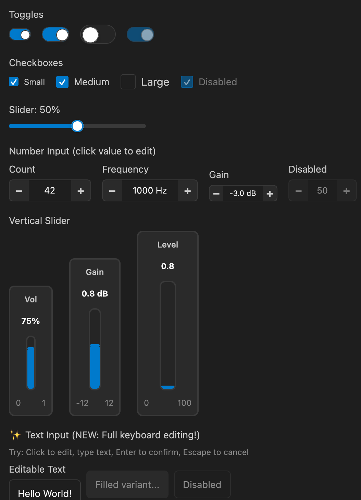
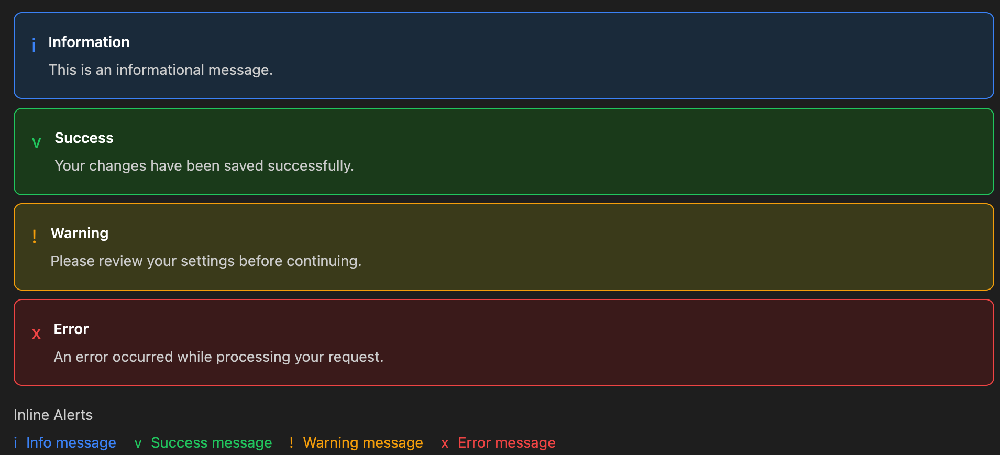
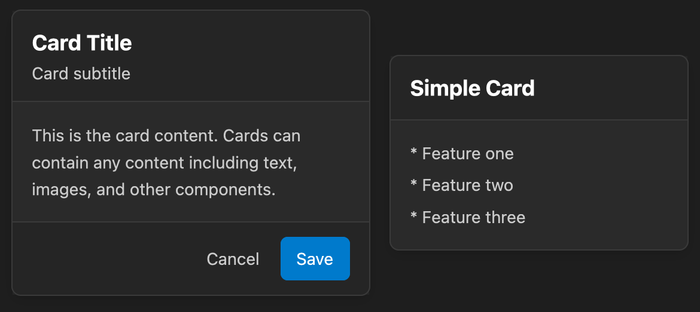
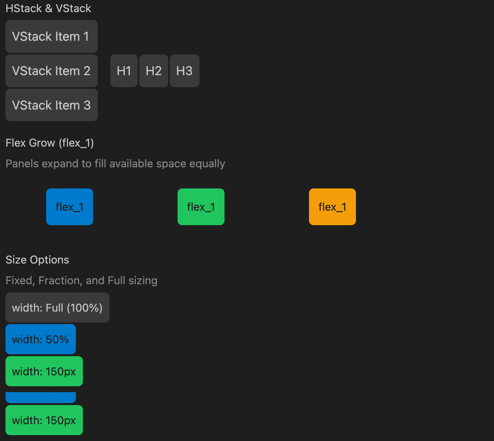
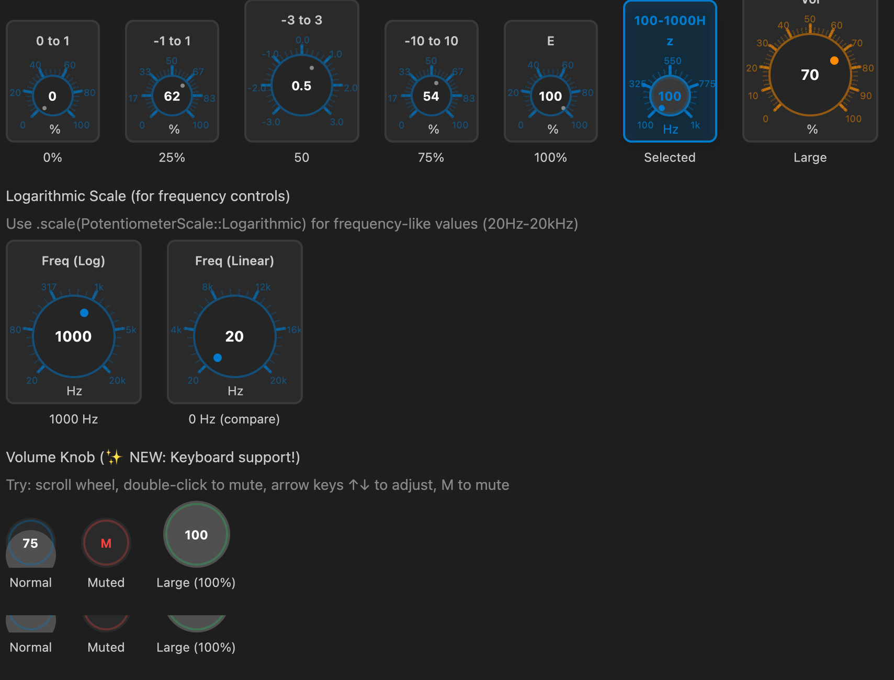
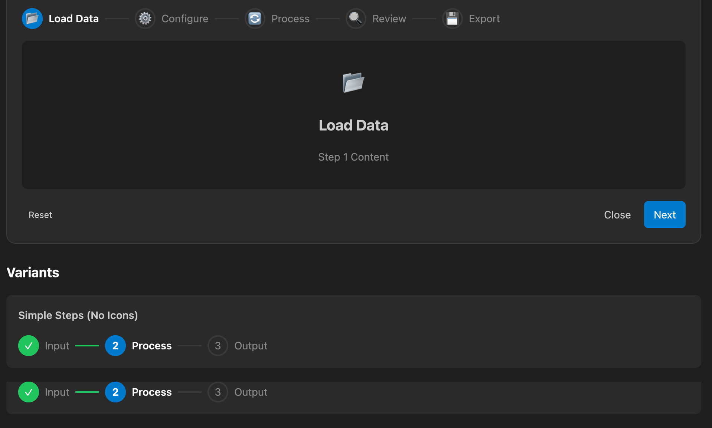
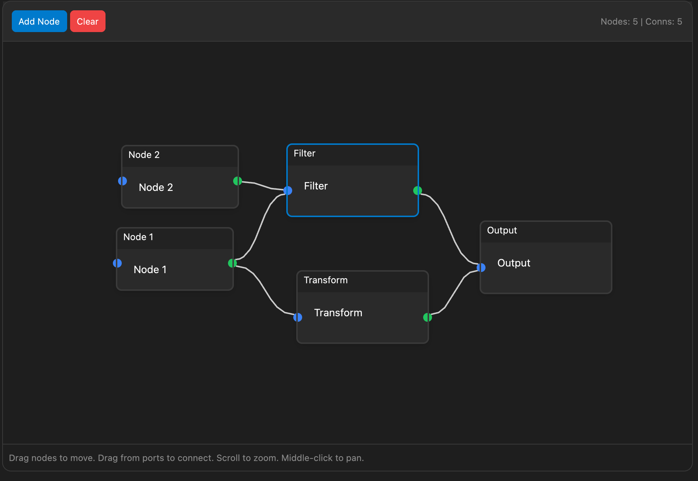

# gpui-ui-kit

A reusable UI component library for [GPUI](https://github.com/zed-industries/zed) applications.

Provides composable, styled UI components with consistent theming for building desktop applications with the GPUI framework.

## Showcase

First app built with gpui-ui-kit is [SotF](https://github.com/pierreaubert/sotf).


## Installation

Add to your `Cargo.toml`:

```toml
[dependencies]
gpui-ui-kit = { version = "0.1.17", git="https://github.com/pierreaubert/sotf/gpui-ui-kit" }
```

## Components

### Core Components

| Component | Description |
|-----------|-------------|
| `Button` | Styled button with variants (Primary, Secondary, Destructive, Ghost, Outline) |
| `IconButton` | Icon-only button with hover states |
| `Card` | Container with optional header, content, and footer sections |
| `Dialog` | Modal dialog with backdrop, title, and customizable size |
| `Menu` / `MenuBar` | Navigation menus and menu bars |
| `Tabs` | Tabbed navigation with Underline, Enclosed, and Pills variants |
| `Toast` / `ToastContainer` | Notification toasts with positioning |

### Form Components

| Component | Description |
|-----------|-------------|
| `Input` | Text input with label, placeholder, validation, mouse drag selection, clipboard (Cmd+C/V/X), and Emacs keybindings |
| `NumberInput` | Numeric input with +/- buttons, min/max bounds, step size, scroll wheel support, and keyboard navigation |
| `Checkbox` | Checkbox with label and indeterminate state |
| `Toggle` | Toggle switch |
| `Select` | Dropdown select with options |
| `ButtonSet` | Grouped button options for single selection |
| `ColorPicker` | Color picker with palette and custom color input |
| `Slider` | Horizontal slider with value display |
| `Wizard` | Multi-step wizard with navigation and step validation |

### Data Display

| Component | Description |
|-----------|-------------|
| `Badge` / `BadgeDot` | Status badges with variants |
| `Progress` / `CircularProgress` | Progress bars and circular indicators |
| `Spinner` / `LoadingDots` | Loading indicators |
| `Avatar` / `AvatarGroup` | User avatars with status indicators |
| `Text` / `Heading` / `Code` / `Link` | Typography components |

### Feedback

| Component | Description |
|-----------|-------------|
| `Alert` / `InlineAlert` | Contextual feedback messages (Info, Success, Warning, Error) |
| `Tooltip` | Hover tooltips with placement options |

### Layout

| Component | Description |
|-----------|-------------|
| `VStack` / `HStack` | Vertical and horizontal stack layouts |
| `Spacer` | Flexible spacer element |
| `Divider` | Horizontal/vertical dividers with optional interactivity |
| `PaneDivider` | Resizable pane divider for split views |
| `Accordion` | Collapsible content panels |
| `Breadcrumbs` | Navigation breadcrumbs |

### Audio Controls

| Component | Description |
|-----------|-------------|
| `Potentiometer` | Rotary knob control with customizable range and visual feedback |
| `VerticalSlider` | Vertical slider with ticks and value display |
| `VolumeKnob` | Specialized volume control with mute state and dB display |

## Usage Examples

### Button

```rust
use gpui_ui_kit::{Button, ButtonVariant, ButtonSize};

// Basic button
Button::new("btn-save", "Save")

// Primary button with click handler
Button::new("btn-submit", "Submit")
    .variant(ButtonVariant::Primary)
    .on_click(|window, cx| {
        println!("Button clicked!");
    })

// Destructive button
Button::new("btn-delete", "Delete")
    .variant(ButtonVariant::Destructive)
    .size(ButtonSize::Sm)

// Ghost button with icon
Button::new("btn-menu", "Menu")
    .variant(ButtonVariant::Ghost)
    .icon_left("☰")

// Full width disabled button
Button::new("btn-loading", "Loading...")
    .full_width(true)
    .disabled(true)
```

### Card

```rust
use gpui_ui_kit::Card;
use gpui::div;

Card::new()
    .header(div().child("Card Title"))
    .content(div().child("Card content goes here"))
    .footer(
        div().flex().gap_2()
            .child(Button::new("cancel", "Cancel").variant(ButtonVariant::Ghost))
            .child(Button::new("save", "Save"))
    )
```

### Input

```rust
use gpui_ui_kit::{Input, InputSize, InputVariant};

// Basic input with label
Input::new("email")
    .label("Email")
    .placeholder("Enter your email")

// Input with error
Input::new("username")
    .label("Username")
    .value("invalid!")
    .error("Username contains invalid characters")

// Filled variant with icon
Input::new("search")
    .variant(InputVariant::Filled)
    .placeholder("Search...")
    .icon_left("🔍")

// Input with change callback
Input::new("name")
    .label("Name")
    .on_change(|value, window, cx| {
        println!("Input changed: {}", value);
    })
```

**Input Features:**
- **Mouse drag selection**: Click and drag to select text ranges
- **Double-click**: Select all text
- **Clipboard**: Cmd+C (copy), Cmd+V (paste), Cmd+X (cut), Cmd+A (select all)
- **Emacs keybindings**: Ctrl+A (beginning), Ctrl+E (end), Ctrl+K (kill to end), Ctrl+U (kill to beginning)
- **Navigation**: Arrow keys, Home/End, Backspace/Delete

### NumberInput

```rust
use gpui_ui_kit::{NumberInput, NumberInputSize};

// Basic number input
NumberInput::new("quantity")
    .label("Quantity")
    .value(10.0)
    .min(0.0)
    .max(100.0)
    .step(1.0)

// Number input with decimals and units
NumberInput::new("frequency")
    .label("Frequency")
    .value(1000.0)
    .min(20.0)
    .max(20000.0)
    .step(10.0)
    .decimals(1)
    .unit("Hz")
    .width(120.0)
    .on_change(|value, window, cx| {
        println!("Frequency: {} Hz", value);
    })

// Compact size for dense layouts
NumberInput::new("gain")
    .value(0.0)
    .min(-12.0)
    .max(12.0)
    .step(0.5)
    .decimals(1)
    .unit("dB")
    .size(NumberInputSize::Sm)
```

**NumberInput Features:**
- **+/- buttons**: Click to increment/decrement by step size
- **Click to edit**: Click the value to enter edit mode
- **Double-click**: Select all text in edit mode
- **Scroll wheel**: Scroll up/down to adjust value
- **Arrow keys**: Up/Down to adjust value when focused
- **Bounds enforcement**: Values clamped to min/max range

### Tabs

```rust
use gpui_ui_kit::{Tabs, TabItem, TabVariant};

Tabs::new()
    .tabs(vec![
        TabItem::new("general", "General").icon("⚙"),
        TabItem::new("audio", "Audio").icon("🔊"),
        TabItem::new("video", "Video").icon("🎬").badge("New"),
    ])
    .selected_index(0)
    .variant(TabVariant::Underline)
    .on_change(|index, window, cx| {
        println!("Selected tab: {}", index);
    })
```

### Dialog

```rust
use gpui_ui_kit::{Dialog, DialogSize};
use gpui::div;

Dialog::new("confirm-dialog")
    .title("Confirm Action")
    .size(DialogSize::Md)
    .content(div().child("Are you sure you want to proceed?"))
    .footer(
        div().flex().gap_2().justify_end()
            .child(Button::new("cancel", "Cancel").variant(ButtonVariant::Ghost))
            .child(Button::new("confirm", "Confirm"))
    )
    .on_close(|window, cx| {
        // Handle dialog close
    })
```

### Alert

```rust
use gpui_ui_kit::{Alert, AlertVariant, InlineAlert};

// Full alert with title
Alert::new("error-alert", "Something went wrong. Please try again.")
    .title("Error")
    .variant(AlertVariant::Error)
    .closeable(true)
    .on_close(|window, cx| {
        // Dismiss alert
    })

// Inline alert
InlineAlert::new("Operation completed successfully")
    .variant(AlertVariant::Success)
```

### Stack Layouts

```rust
use gpui_ui_kit::{VStack, HStack, Spacer, Divider, StackSpacing, StackAlign};

// Vertical stack
VStack::new()
    .spacing(StackSpacing::Lg)
    .align(StackAlign::Center)
    .child(Text::new("Title").size(TextSize::Xl))
    .child(Text::new("Subtitle"))
    .child(Spacer::new())
    .child(Button::new("action", "Action"))

// Horizontal stack with divider
HStack::new()
    .spacing(StackSpacing::Md)
    .child(Button::new("a", "Option A"))
    .child(Divider::vertical())
    .child(Button::new("b", "Option B"))
```

### Progress

```rust
use gpui_ui_kit::{Progress, CircularProgress, ProgressVariant, ProgressSize};

// Linear progress bar
Progress::new(75.0)
    .variant(ProgressVariant::Success)
    .size(ProgressSize::Md)
    .show_label(true)

// Circular progress
CircularProgress::new(60.0)
    .size(px(64.0))
    .variant(ProgressVariant::Default)
    .show_label(true)
```

### Checkbox and Toggle

```rust
use gpui_ui_kit::{Checkbox, Toggle, CheckboxSize, ToggleSize};

// Checkbox with label
Checkbox::new("agree")
    .label("I agree to the terms")
    .checked(true)
    .on_change(|checked, window, cx| {
        println!("Checked: {}", checked);
    })

// Toggle switch
Toggle::new("notifications")
    .label("Enable notifications")
    .checked(false)
    .size(ToggleSize::Md)
```

### Select

```rust
use gpui_ui_kit::{Select, SelectOption, SelectSize};

Select::new("theme-select")
    .label("Theme")
    .placeholder("Choose a theme")
    .options(vec![
        SelectOption::new("light", "Light"),
        SelectOption::new("dark", "Dark"),
        SelectOption::new("system", "System").disabled(true),
    ])
    .selected("dark")
    .on_change(|value, window, cx| {
        println!("Selected: {}", value);
    })
```

### Avatar

```rust
use gpui_ui_kit::{Avatar, AvatarGroup, AvatarSize, AvatarStatus};

// Single avatar with status
Avatar::new("user-1")
    .initials("JD")
    .size(AvatarSize::Lg)
    .status(AvatarStatus::Online)

// Avatar group
AvatarGroup::new()
    .avatars(vec![
        Avatar::new("u1").initials("AB"),
        Avatar::new("u2").initials("CD"),
        Avatar::new("u3").initials("EF"),
    ])
    .max_visible(3)
```

### Tooltip

```rust
use gpui_ui_kit::{Tooltip, TooltipPlacement, WithTooltip};

// Wrap any element with a tooltip
WithTooltip::new(
    Button::new("help", "?").variant(ButtonVariant::Ghost),
    Tooltip::new("Click for help").placement(TooltipPlacement::Bottom)
)
```

### Accordion

```rust
use gpui_ui_kit::{Accordion, AccordionItem, AccordionMode};
use gpui::div;

Accordion::new("faq")
    .mode(AccordionMode::Single)
    .items(vec![
        AccordionItem::new("q1", "What is GPUI?")
            .content(div().child("GPUI is a GPU-accelerated UI framework.")),
        AccordionItem::new("q2", "How do I install it?")
            .content(div().child("Add it to your Cargo.toml dependencies.")),
    ])
```

### ButtonSet

```rust
use gpui_ui_kit::{ButtonSet, ButtonSetOption, ButtonSetSize};

ButtonSet::new("view-mode")
    .options(vec![
        ButtonSetOption::new("list", "List").icon("☰"),
        ButtonSetOption::new("grid", "Grid").icon("⊞"),
        ButtonSetOption::new("compact", "Compact").icon("≡"),
    ])
    .selected("grid")
    .size(ButtonSetSize::Md)
    .on_change(|value, window, cx| {
        println!("View mode: {}", value);
    })
```

### Potentiometer

```rust
use gpui_ui_kit::{Potentiometer, PotentiometerSize};

// Basic rotary knob
Potentiometer::new("volume")
    .value(0.75)
    .min(0.0)
    .max(1.0)
    .size(PotentiometerSize::Md)
    .on_change(|value, window, cx| {
        println!("Volume: {:.0}%", value * 100.0);
    })

// With label and units
Potentiometer::new("pan")
    .label("Pan")
    .value(0.0)
    .min(-1.0)
    .max(1.0)
    .unit("L/R")
```

### VerticalSlider

```rust
use gpui_ui_kit::{VerticalSlider, VerticalSliderSize};

VerticalSlider::new("fader")
    .value(0.0)
    .min(-60.0)
    .max(12.0)
    .height(200.0)
    .show_ticks(true)
    .on_change(|value, window, cx| {
        println!("Level: {:.1} dB", value);
    })
```

### VolumeKnob

```rust
use gpui_ui_kit::{VolumeKnob, VolumeKnobSize};

VolumeKnob::new("master-volume")
    .value(0.8)
    .muted(false)
    .size(VolumeKnobSize::Lg)
    .on_change(|value, window, cx| {
        println!("Volume: {:.0}%", value * 100.0);
    })
    .on_mute_toggle(|muted, window, cx| {
        println!("Muted: {}", muted);
    })
```

### Wizard

```rust
use gpui_ui_kit::{Wizard, WizardStep, WizardStepStatus};
use gpui::div;

Wizard::new("setup-wizard")
    .steps(vec![
        WizardStep::new("welcome", "Welcome")
            .status(WizardStepStatus::Completed)
            .content(div().child("Welcome to the setup wizard!")),
        WizardStep::new("config", "Configuration")
            .status(WizardStepStatus::Current)
            .content(div().child("Configure your settings here.")),
        WizardStep::new("finish", "Finish")
            .status(WizardStepStatus::Pending)
            .content(div().child("Setup complete!")),
    ])
    .current_step(1)
    .on_next(|step, window, cx| {
        println!("Moving to step: {}", step);
    })
    .on_back(|step, window, cx| {
        println!("Going back to step: {}", step);
    })
```

## Theming

Components use a default dark theme. Button theme can be customized:

```rust
use gpui_ui_kit::{Button, ButtonTheme};
use gpui::rgb;

let custom_theme = ButtonTheme {
    accent: rgb(0x6366f1),      // Indigo accent
    accent_hover: rgb(0x818cf8),
    surface: rgb(0x374151),
    surface_hover: rgb(0x4b5563),
    text_primary: rgb(0xffffff),
    text_secondary: rgb(0xd1d5db),
    error: rgb(0xef4444),
    border: rgb(0x6b7280),
};

Button::new("themed", "Themed Button")
    .theme(custom_theme)
```

## Design Patterns

### Builder Pattern

All components use the builder pattern for configuration:

```rust
Component::new(required_args)
    .optional_setting(value)
    .another_setting(value)
    // Either render directly or build for additional handlers
```

### Event Handlers

Components that support interaction accept closures:

```rust
Button::new("btn", "Click")
    .on_click(|window, cx| {
        // Handle click
    })

Checkbox::new("cb")
    .on_change(|checked, window, cx| {
        // Handle change
    })
```

### Using with GPUI Listeners

For components that need `cx.listener()`, use the `build()` method:

```rust
Button::new("btn", "Save")
    .build()
    .on_click(cx.listener(|this, _event, window, cx| {
        this.save(cx);
    }))
```

## Testing

The library includes a comprehensive test suite to prevent regressions:

```bash
# Run all tests
cargo test --lib --tests

# Run specific test suite
cargo test --test i18n_tests      # Translation coverage
cargo test --test component_tests  # Component API tests

# Setup git hooks for automatic testing
./scripts/setup-hooks.sh
```

**Test Coverage**:
- ✅ **Integration Tests** (237 tests): Comprehensive UI component tests including mouse actions, button clicks, keyboard navigation, and visual rendering
- ✅ **Interaction Tests** (37 tests): Verify all stateful components support mouse and keyboard events
- ✅ **Component Tests** (15 tests): Ensure component APIs work correctly and configurations are valid
- ✅ **I18n Tests** (11 tests): Verify all translations exist across 5 languages (English, French, German, Spanish, Japanese)
- ✅ **Library Tests** (10 tests): Verify MiniApp configuration and utilities
- ✅ **310 total tests** covering critical functionality

See [`TESTING.md`](TESTING.md) for detailed testing guide and [`tests/README.md`](tests/README.md) for quick reference.

## Development

### Running the Showcase

```bash
cargo run --example showcase
```

The showcase demonstrates all components with:
- Interactive examples for each component
- Theme switching (Light/Dark)
- Language switching (5 languages)
- Navigation sidebar

### Before Committing

```bash
# Format code
cargo fmt

# Run tests
cargo test --lib --tests

# Run clippy
cargo clippy --all-targets -- -D warnings
```

Or setup git hooks to run automatically:
```bash
./scripts/setup-hooks.sh
```

## Examples

A showcase is provided that demonstrate the capabilities of the library. Here are few examples:

| Buttons | Fonts |
| :---: | :---: |
|  |  |
| Badges | Avatars |
|  |  |
| Inputs | Progress |
|  |  |
| Alerts |  |
|  |  |
| Tabs | Layouts |
|  |  |
| Menus | Potentiometers |
|  |  |
| Wizard | Workflow |
|  |  |


## License

Permissive [ISC License](https://en.wikipedia.org/wiki/ISC_license)
